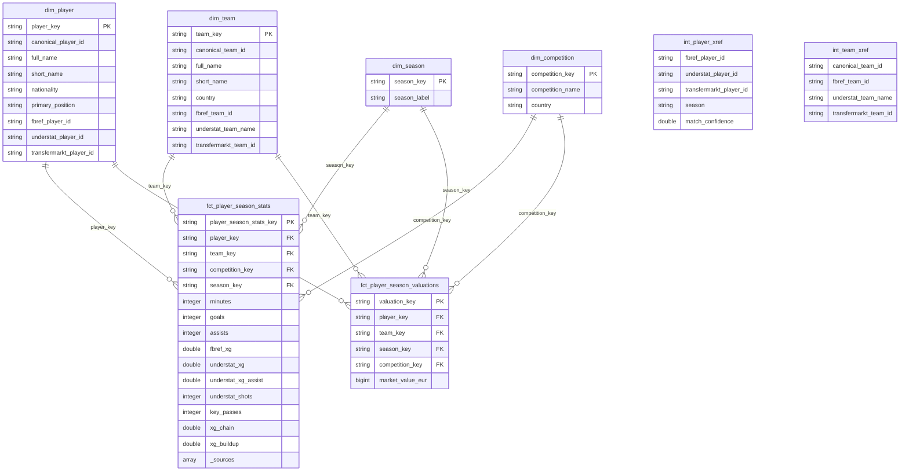

# Data Model

## Entity-Relationship Diagram



## Fact Tables

**`fct_player_season_stats`** — one row per player per team per season. FBref provides core appearance and performance stats (games, minutes, goals, assists, cards). Understat enriches with expected metrics (xG, xA, xG Chain, xG Buildup) via entity resolution. The `_sources` array indicates which sources contributed to each row.

**`fct_player_season_valuations`** — one row per player per team per season. Market values in EUR from Transfermarkt, joined to the star schema via entity resolution.

## Dimension Tables

**`dim_player`** — one row per player. Source IDs from FBref, Understat, and Transfermarkt are populated via `int_player_xref` entity resolution.

**`dim_team`** — one row per team. Source IDs mapped via `int_team_xref` (curated seed file).

**`dim_competition`** — top 5 European leagues (Premier League, La Liga, Bundesliga, Serie A, Ligue 1).

**`dim_season`** — seasons in scope (2023-2024, 2024-2025, 2025-2026).

## Intermediate Tables

**`int_player_xref`** — cross-reference mapping player IDs across sources. Uses deterministic fuzzy matching (Jaro-Winkler on normalized names, date of birth, team/league overlap) with confidence scores.

**`int_team_xref`** — cross-reference mapping team names across sources. Driven by the `team_name_mappings` seed file.

## Data Flow

```
Raw (Bronze)          Staging (Silver)         Intermediate          Marts (Gold)
─────────────         ────────────────         ────────────          ────────────
raw_fbref__*    →  stg_fbref__*          ┐
raw_understat__ →  stg_understat__*      ├→  int_player_xref  →  dim_player
raw_transfermarkt → stg_transfermarkt__* ┘   int_team_xref    →  dim_team
                                                                   dim_competition
                                                                   dim_season
                                                                   fct_player_season_stats
                                                                   fct_player_season_valuations
```

## Phase 2 (planned)

- **`dim_match`** — match dimension with date, home/away teams, score, matchweek
- **`fct_player_match_stats`** — player stats at match-level grain
- **`fct_team_match_stats`** — team stats at match-level grain (requires match-level data from FBref)
