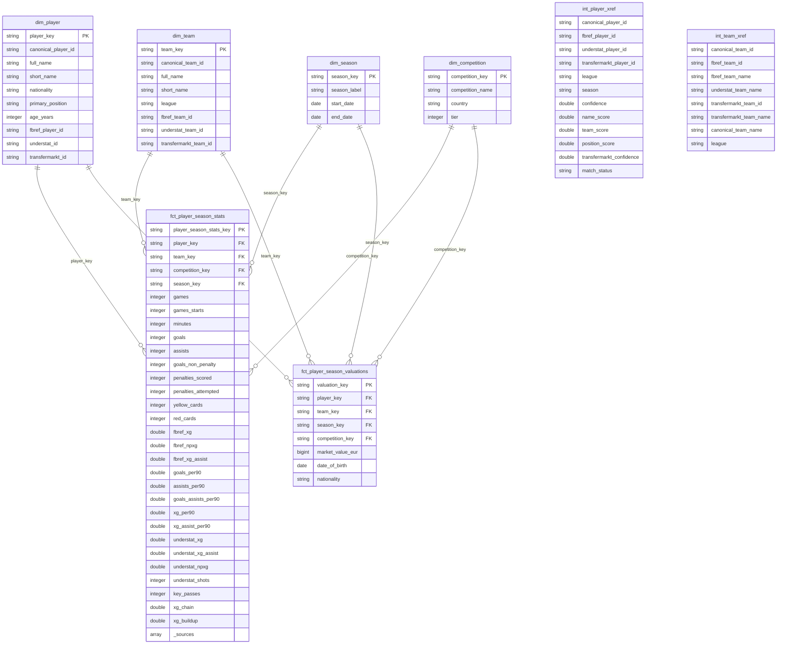

# Data Model

## Entity-Relationship Diagram



## Fact Tables

**`fct_player_season_stats`** — one row per player per team per season. FBref provides core appearance and performance stats (games, minutes, goals, assists, cards, per-90 metrics, xG). Understat enriches with expected metrics (xG, xA, npxG, xG Chain, xG Buildup) via entity resolution. The `_sources` array indicates which sources contributed to each row.

**`fct_player_season_valuations`** — one row per player per team per season. Market values in EUR from Transfermarkt, joined to the star schema via entity resolution. Includes player date of birth and nationality from the Transfermarkt source.

## Dimension Tables

**`dim_player`** — one row per player. Source IDs from FBref, Understat, and Transfermarkt are populated via `int_player_xref` entity resolution. Uses the latest season's attributes for each player.

**`dim_team`** — one row per team. Source IDs mapped via `int_team_xref` (curated seed file).

**`dim_competition`** — top 5 European leagues (Premier League, La Liga, Bundesliga, Serie A, Ligue 1). Hardcoded dimension.

**`dim_season`** — seasons in scope (2023-2024, 2024-2025, 2025-2026). Hardcoded dimension with start and end dates.

## Intermediate Tables

**`int_player_xref`** — cross-reference mapping player IDs across sources. Uses deterministic fuzzy matching with Jaro-Winkler name similarity, team overlap via `int_team_xref`, and position compatibility. Outputs confidence scores and match status (`auto_matched` >= 0.90, `review_needed` >= 0.75). Manual overrides applied from the `player_match_overrides` seed.

**`int_team_xref`** — cross-reference mapping team names and IDs across sources. Driven by the `team_name_mappings` seed file with fallback to normalized source names.

## Data Flow

```
Raw (Bronze)              Staging (Silver)              Intermediate              Marts (Gold)
──────────────            ──────────────────            ────────────              ────────────

raw_fbref__*         →  stg_fbref__*             ┐
                                                  ├→  int_player_xref  ──┐
raw_understat__*     →  stg_understat__*         ┘                      ├→  dim_player
                                                                        │
raw_transfermarkt__* →  stg_transfermarkt__*  ───────────────────────────┤
                                                                        │
                        team_name_mappings (seed) →  int_team_xref  ────┼→  dim_team
                                                                        │
                                              (hardcoded)  ─────────────┼→  dim_competition
                                              (hardcoded)  ─────────────┼→  dim_season
                                                                        │
                        stg_fbref__*  ──────────────────────────────────┼→  fct_player_season_stats
                        stg_understat__*  + int_player_xref  ───────────┤
                                                                        │
                        stg_transfermarkt__* + int_player_xref  ────────┴→  fct_player_season_valuations
```

## Phase 2 (planned)

- **`dim_match`** — match dimension with date, home/away teams, score, matchweek
- **`fct_player_match_stats`** — player stats at match-level grain
- **`fct_team_match_stats`** — team stats at match-level grain (requires match-level data from FBref)
